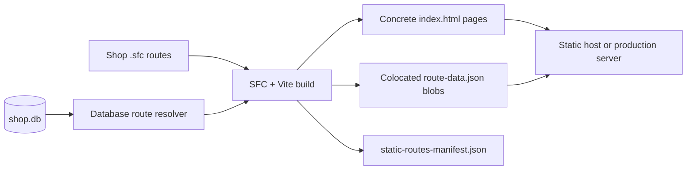
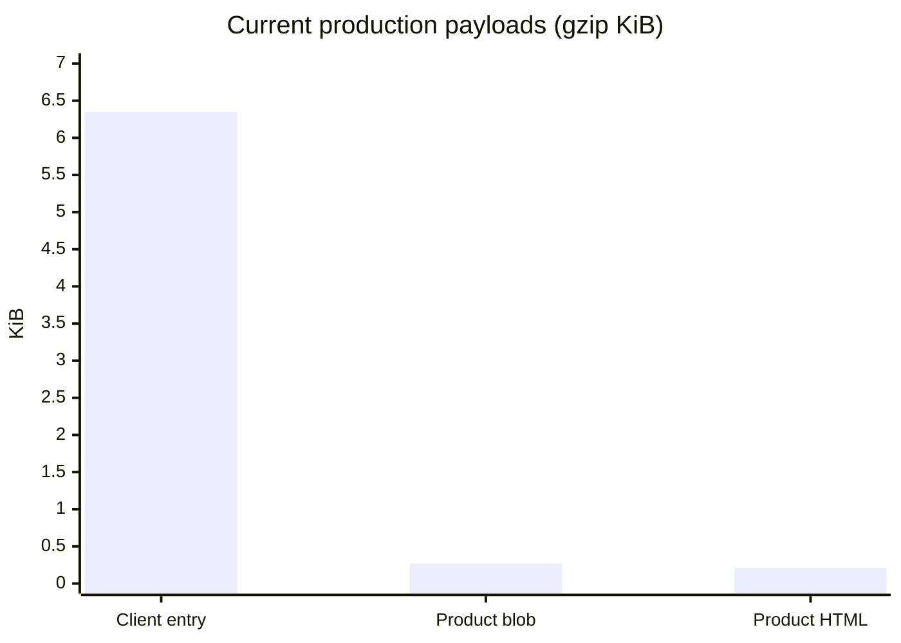
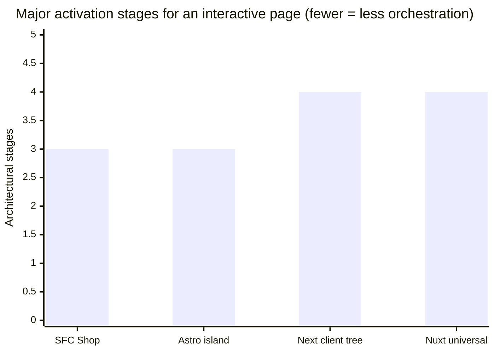

# SFC Shop

SFC Shop is a deliberately small full-stack storefront built with native custom
elements, `.sfc` components, SQLite, and database-driven static generation. It
keeps the productive parts of a modern framework—file-local templates, scripts,
styles, routing, lazy loading, and server APIs—without shipping a virtual DOM or
running a hydration pass over the page.

The demo includes product browsing, product detail pages, a session cart,
checkout, order history, clean-URL routing, and a production build that expands
database rows into deployable HTML and JSON route blobs.

> This is a focused shop demo and framework experiment, not a drop-in
> replacement for the broader ecosystems and deployment integrations offered by
> Next.js, Nuxt, or Astro.

## Features

- **Native component runtime** — `.sfc` files compile to browser custom elements.
- **No virtual-DOM hydration** — interactivity starts through custom-element
  lifecycle hooks and native event listeners.
- **Database-generated routes** — products and orders become concrete build
  paths based on SQLite records.
- **Colocated data blobs** — each generated route receives a
  `route-data.json`; public product pages can render without another product API
  request.
- **Strict build validation** — missing parameters, duplicate routes, unresolved
  placeholders, and unsafe path values fail the build.
- **Route-level code splitting** — components are imported only when their route
  is visited or predictively preloaded.
- **Persistent image previews** — images automatically reuse quarter-resolution
  WebP previews from an LRU browser cache while the full source loads.
- **SPA navigation with real URLs** — links, history navigation, clean refreshes,
  and the View Transition API work together.
- **Integrated shop API** — products, cart operations, checkout, and orders use
  the same SQLite database in development and production.
- **Production HTTP basics included** — Brotli/gzip, ETags, immutable hashed
  assets, clean URL resolution, and keep-alive connections.
- **Two serving modes** — a JIT development server and a built production
  server, both without an additional application framework.

## Quick start

```bash
npm install
npm run serve:dev
```

Open <http://localhost:5173>.

For the database-generated production build:

```bash
npm run build
export AUTH_ORIGIN=https://shop.example.com
export AUTH_RP_ID=shop.example.com
npm run serve
```

Production authentication fails closed unless `AUTH_ORIGIN` is an HTTPS public
origin and its hostname exactly matches `AUTH_RP_ID`. Terminate TLS at the
application or its reverse proxy. Set `PORT` to change the production port; the
development server accepts `--port=<number>`.

Customer accounts use normalized email addresses and passwords hashed with
Argon2id. Authentication is carried by hashed, server-side session records and
an `HttpOnly`, `Secure`, `SameSite=Strict` production cookie. State-changing
requests also require an exact-origin check and a session-bound CSRF token.

## Image preview cache

Every `` rendered by an SFC component is handled automatically. After an
image first loads, the runtime stores a WebP preview at one quarter of its
width and height in IndexedDB. On later visits that preview is displayed first
and replaced as soon as the full image is ready.

The cache has a 50 MiB byte budget by default and evicts least-recently-used
previews when it reaches the limit. An application can change the budget before
components mount:

```ts
import { configureImagePreviewCache } from './runtime';

configureImagePreviewCache({ maxSize: 20 * 1024 * 1024 });
```

No image attributes are required. Opt a specific image out with
`no-image-cache`:

```html

```

Cross-origin images are cached when their host permits CORS. If IndexedDB,
canvas encoding, or CORS access is unavailable, the image keeps its normal
browser loading behavior.

## How the build works



Dynamic routes declare the source that can enumerate their parameters:

```html
<route path="/shop/product/:id" methods="GET" prerender="products" />
```

One product row then produces:

```text
dist/public/shop/product/1/index.html
dist/public/shop/product/1/route-data.json
```

Product data is safe to publish and is included in its blob. Order routes are
never enumerated or prerendered; order details remain behind authenticated,
per-user server authorization.

## Performance snapshot

Measured on this repository on 2026-07-30 with Node.js 22.14 on Windows. The
build figure is the median of three warm production builds (`2.02 s`, `2.20 s`,
`2.09 s`). These numbers describe this demo only and will change with content,
hardware, dependency versions, and component count.

| Metric | Current result |
|---|---:|
| Warm production build, median | **2.09 s** |
| Modules transformed | **29** |
| Concrete generated routes | **21** |
| Client entry JavaScript | **18.78 KiB raw / 6.35 KiB gzip** |
| Product route data blob | **0.45 KiB raw / 0.27 KiB gzip** |
| Generated product HTML shell | **0.29 KiB raw / 0.21 KiB gzip** |



## Speed model versus full-stack frameworks

There is no honest universal “framework X is N× faster” number. Equivalent
applications must be benchmarked on the same machine, deployment target,
cache state, network, and interaction path. The graphs below therefore compare
the **major architectural stages** used to activate an interactive, data-backed
page—not elapsed milliseconds.



The stage model used above:

```mermaid
flowchart TB
    subgraph SFC["SFC Shop · 3 stages"]
      S1[Static HTML + route blob] --> S2[Route ESM] --> S3[Custom-element upgrade]
    end
    subgraph Astro["Astro interactive island · 3 stages"]
      A1[Static HTML] --> A2[Island JavaScript] --> A3[Hydrate selected island]
    end
    subgraph Next["Next.js interactive client tree · 4 stages"]
      N1[Server or cached RSC work] --> N2[HTML + RSC payload] --> N3[Client JavaScript] --> N4[Hydrate client components]
    end
    subgraph Nuxt["Nuxt universal rendering · 4 stages"]
      U1[Server or cached render] --> U2[HTML + state] --> U3[Vue JavaScript] --> U4[Hydrate application]
    end
```



| Framework/model | Typical client activation scope | Request-time rendering available? | Where it wins |
|---|---|---:|---|
| **SFC Shop** | Native route component; no VDOM hydration | API only; public pages are prebuilt | Small, database-backed storefronts with a narrow runtime |
| **Astro islands** | Only components marked for client hydration | Yes, including server islands | Mostly static/content pages with isolated interactive regions |
| **Next.js App Router** | Client-component subtrees; Server Components add no client JS | Yes, plus caching, streaming, and revalidation | Large React applications needing hybrid rendering and a deep ecosystem |
| **Nuxt universal** | Vue takes over the server-rendered application through hydration | Yes, with universal and hybrid rendering | Large Vue applications needing integrated SSR and conventions |

The comparison reflects each framework's documented model:

- [Next.js Server and Client Components](https://nextjs.org/docs/app/getting-started/server-and-client-components)
  describes HTML/RSC reconciliation and hydration of Client Components.
- [Nuxt rendering modes](https://nuxt.com/docs/3.x/guide/concepts/rendering)
  describes universal rendering followed by Vue hydration, as well as static
  generation options.
- [Astro islands](https://docs.astro.build/en/concepts/islands/) describes
  static HTML with selective hydration for explicitly interactive islands.

In practice, Astro can have less client work than this shop when a page is
entirely static; Next.js can ship little client JavaScript when a route stays
within Server Components; and Nuxt can prerender routes. SFC Shop's advantage is
not magic—it is the result of a deliberately smaller feature surface and a
build-time data model.

## Project layout

```text
components/
  Home.sfc                 Root redirect
  NotFound.sfc             Fallback page
  GlobalStyles.sfc         Shared styles
  shop/                    Shop UI components
src/
  main.ts                  Client router
  runtime/                 Custom-element runtime
  plugin.ts                Vite SFC/build plugin
  transformer.ts           SFC compiler
server.js                  Development server
server.prod.js             Production static/API server
shop-db.js                 SQLite access
shop-static-routes.js      Build-time database route resolver
vite.config.build.ts       Production build configuration
```
